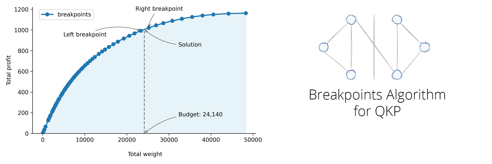

[](LICENSE)
[](https://arxiv.org/abs/2408.12183)

# Description

This software produces solutions to the well-known Quadratic Knapsack Problem (QKP). The QKP is to select a subset of elements that maximizes the sum of pairwise and singleton utilities such that the sum of weights of the elements in the selected subset does not exceed a given budget.

# Installation

1. Clone the repository.

2. Compile the C code of the simple parametric cut procedure `QKPsimparamHPF.c` with a GNU C compiler.

    For Linux/Mac users:
    1. Open a terminal and navigate to the folder that contains the file `QKPsimparamHPF.c`.
    2. Compile the C code with the command:
       ```bash
       gcc QKPsimparamHPF.c -o QKPsimparamHPF.exe
       ```

    For Windows users:
    1. Install [Cygwin](https://www.cygwin.com/).
    2. Open the Cygwin shell and navigate to the folder that contains the file `QKPsimparamHPF.c`.
    3. Compile the C code with the command:
       ```bash
       gcc QKPsimparamHPF.c -o QKPsimparamHPF.exe
       ```

3. All set, you can now run the algorithm in the `run_illustrative_example.py` or `run_instance.py` file.

## Usage

Import the `run_bp_algorithm` function from the `breakpoints_algorithm` module and the `load_instance` function from the `util` module. Then, load a problem instance from a file and run the breakpoints algorithm.

```python
from breakpoints_algorithm import run_bp_algorithm
from util import load_instance

# Load a problem instance from a file
items, profits, weights, budgets = load_instance('data/synthetic_tf_2000.txt')

# Run the breakpoints algorithm
results = run_bp_algorithm(items, profits, weights, budgets, n_lambda_values=1600)
````

The `run_bp_algorithm` function takes the following parameters:

- `items`: A list of items.
- `profits`: A dictionary where the keys are pairs of items and the values are the corresponding profits. A singleton profit is represented as a pair of the same item.
- `weights`: A list containing the weights for each item.
- `budgets`: A list of knapsack capacities. A separate solution will be computed for each capacity.
- `n_lambda_values`: The number of lambda values to consider in the breakpoints algorithm.

The file that contains the problem instance should have the following format:

```
first line: number of items (n), number of profits (m), data type of profits (int or float)
lines 2 to m+1: (i, j, profit) for each profit value where i and j are the ids of the items. The ids should be 0,...,n-1.
line m+2: weights of the items separated by a space
line m+3: budgets (knapsack capacities) separated by a space
```


## Reference

Please cite the following paper if you use this code.

**Hochbaum, D. S., Baumann, P., Goldschmidt O., Zhang Y.** (2024): A Fast and Effective Breakpoints Algorithm for the Quadratic Knapsack Problem. URL: https://arxiv.org/abs/2408.12183, arXiv:2408.12183.

Bibtex:
```
@misc{hochbaum2024fast,
	author={Hochbaum, Dorit S. and Baumann, Philipp and Goldschmidt, Olivier and Zhang, Yiqing},
	title = {A Fast and Effective Breakpoints Algorithm for the Quadratic Knapsack Problem},
	year={2024},
	eprint={2408.12183},
	archivePrefix={arXiv},
	primaryClass={math.OC},
	url={https://arxiv.org/abs/2408.12183}, 
}
```
- [Link to paper](https://arxiv.org/abs/2408.12183)
- [Link to the detailed results of the computational study conducted in the paper](https://github.com/phil85/results-for-qkp-benchmark-instances)
- [Link to all benchmark instances used in the computational study conducted in the paper](https://github.com/phil85/benchmark-instances-for-qkp)

[//]: # (- [Repository containing the code for Gurobi-based approach]&#40;https://github.com/phil85/gurobi-based-approach-for-qkp&#41;)
[//]: # (- [Repository containing the code for Hexaly-based approach]&#40;https://github.com/phil85/hexaly-based-approach-for-qkp&#41;)
[//]: # (- [Repository containing the code for the relative greedy algorithm]&#40;https://github.com/phil85/greedy-algorithm-for-qkp&#41;)

## License

This project is licensed under the MIT License - see the [LICENSE](LICENSE) file for details